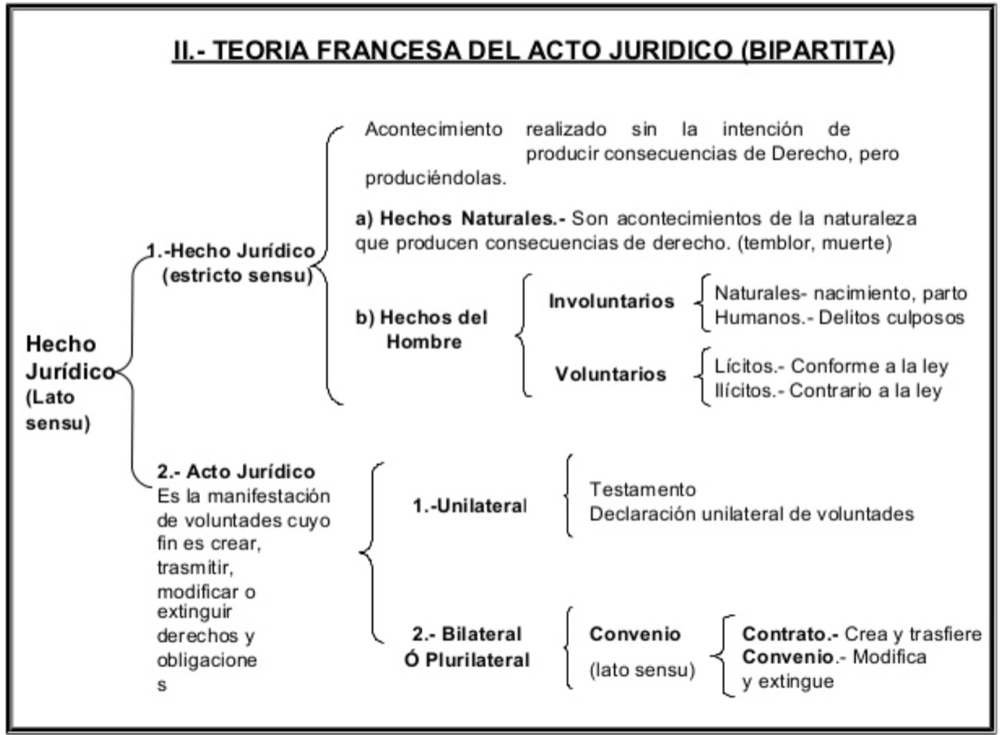

# Fuentes del derecho

+ Fuentes formales
    - Legislación
    - Tratados internacionales

        * Convención de Viena sobre el derecho internacional.
        * Responsabilidad internacional del Estado, ante la Corte Internacional
            de La Haya
        * Denuncia de un tratado.
        * El derecho internacional, con Hugo Grocio, inició por conflictos
            marítimos.
        * *Acuerdos Interinstitucionales*, se rigen por la Ley Federal de
            Tratados. No obligan al país, los tratados sí. Tienen que estar
            registrados en la Cancillería.
        * También está la *diplomacia parlamentaria*.
        * Carta de Roma, Corte Penal Internacional. Para evitar las atrocidades
            de los conflictos armados. Genera la *jurisdicción universal*, que
            cualquier persona puede demandar a cualquier persona del mundo.
        * *Soft law*.
        * No entra en vigor por el simple hecho de firmarlo, se requieren leyes
            de implementación o aplicación.

    - Jurisprudencia.

        * Por reiteración, 5 tesis en el mismo sentido de manera ininterrumpida.
        * Contradicción de tesis, cuando dos tesis se contraponen y la SCJN
            define. Ver la tesis 293/2011.
        * Por sustitución.
        * Antinomias: donde se aplican normas, se hace subsunción; los
            principios no se pueden subsumir, entonces se tienen que ponderar.

    - Costumbre. Derecho consuetudinario.

        * Escuela del *realismo sociológico*.
        * El derecho anglosajón es un derecho costumbrista.
        * *Inveterata consuetudo* (uso reiterado) y reconocimiento de la norma
            hacia esa costumbre (en México).
        * Acuerdos de San Andrés Larraiza, después del conflicto con el EZLN,
            que hizo que se reformara el artículo 2 y se validaran los usos y
            costumbres de los puerblos originarios.

    - Principios generales del derecho.

+ Ámbitos de validez de la norma.
    - Territorial. Derecho conflictual.
    - Personal. Penal, civil, administrativa, política, etc.
    - Temporal.

+ Teoría francesa del hecho jurídico.

+ Ramas del derecho
    - Derecho público:

        * Constitucional
        * Administrativo: Fiscal, Bancario, Energético, Aeroespacial, Agua,
            Salud
        * Penal. Miembros jurídicos tutelados, sanción penal. La fuente es
            necesariamente la ley, principio de taxatividad. Historia: venganza
            privada, venganza pública. *Bill of rights*. Derecho punitivo como
            derecho sustantivo público. La conducta tiene que ser: típica,
            antijurídica, culpable y punible.
        * Procesal. Sistema acusatorio. Concurso ideal (1 conducta y 2 o más
            delitos, las penas se cuentan paralelamente) y real (2 o más
            conductas y 2 o más delitos, las penas se cuentan consecutivamente).
            Procedimiento abreviado, cuando aceptan la responsabilidad. La duda
            razonable del anglosajón no es el *in dubio pro reo* del derecho
            razonable.
        * Público. Procesal (civil, penal, administrativo, laboral, etc.)
        * Internacional Público.
        * Privado. Civil, Mercantil e Internacional Privado.
