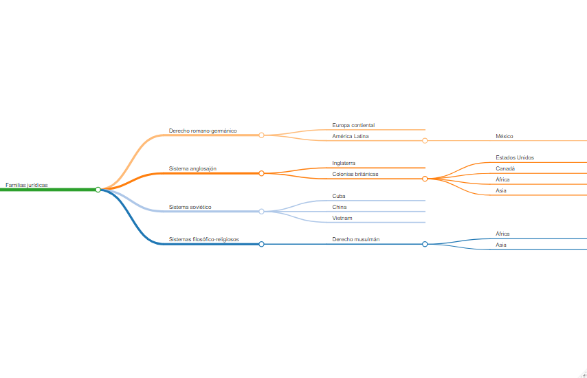

De acuerdo con \citeauthor{lib:bernal}, existen familias del derecho a través de
la historia que se observan en la actualidad; estas familias se presentan en la
siguiente figura.\autocite[20]{lib:bernal}



```{r include = FALSE}
    library('mindr')
    familias <- c('# Derecho romano-germánico',
                  'Basado en la influencia del *ius commune* y con influencia de costumbres germánicas',
                  '## Europa contiental',
                  '## América Latina',
                  '### México',
                  '# Sistema anglosajón',
                  'Basado en el precendente judicial (*common law*), mezcla del derecho normando y las prácticas anglosajonas',
                  '## Inglaterra',
                  '## Colonias británicas',
                  '### Estados Unidos', '### Canadá', '### África', '### Asia',
                  '# Sistema soviético',
                  'Perdió influencia tras la caída del Muro de Berlín en 1989',
                  '## Cuba', '## China', '## Vietnam',
                  '# Sistemas filosófico-religiosos',
                  '## Derecho musulmán',
                  '### África', '### Asia')
    x <- mm(from = familias, type = 'text', root = 'Familias jurídicas')
    x
```